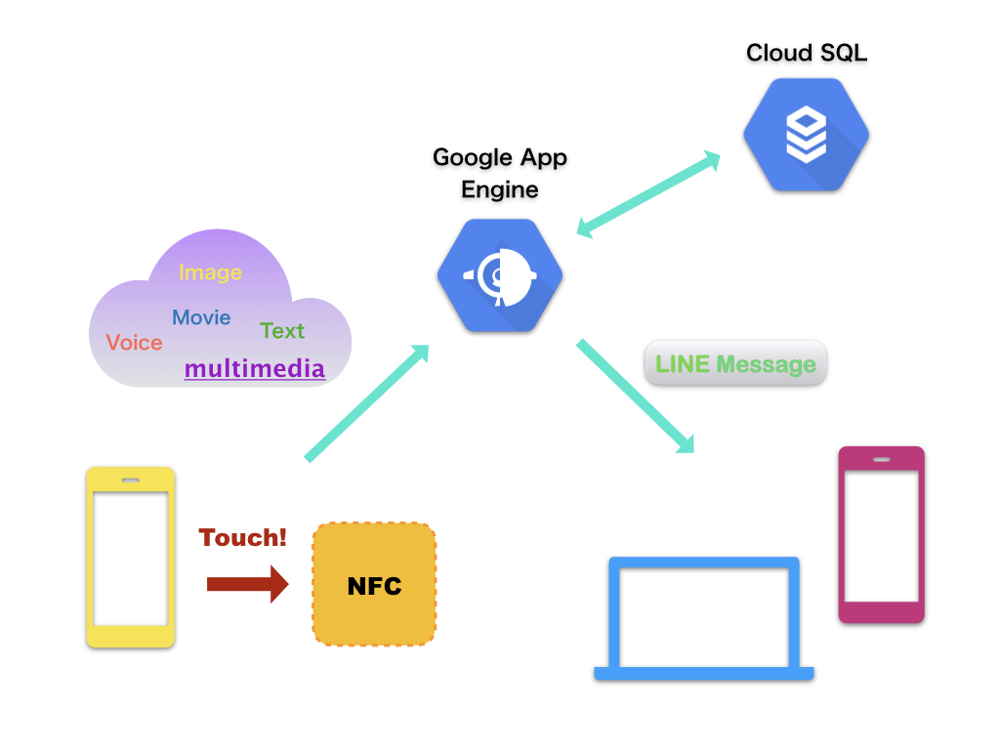

# IN TOUCH ~ Smarter communication ~

## 製品概要
### Communication Tech 

### 背景（製品開発のきっかけ、課題等）
- 共働きのお父さんお母さんたちは子供がいつ帰宅したのか, 無事に帰宅できたのか把握できずに心配になることがしばしば！子供は小さくてまだスマホの使い方もよくわかっていなかったり, わかっていても面倒で連絡を寄越さなかったり...
そんな悩めるママ, パパの悩みを解決したいという気持ちがきっかけとなりました.

### 製品説明（具体的な製品の説明）

- スマートフォンをNFCにかざすだけで帰宅したことを親にLINEで通達してくれるサービスです. 設定次第で音声や画像を送ったり, 音声から作成したテキストメッセージをを送ることも可能です.

### 特長

#### 1. 
スマートフォンをNFCにかざすだけでマルチメディアのメッセージを送信できるため, 近未来のようなスマートな連絡手段を実現.

#### 2. 
ユーザーのカスタマイズ性が高く, 自由度の高いコミュニケーションを行える.

### 解決出来ること
煩わしい手続きをワンタッチに省略できるため, 日常生活をより快適なものにし, 結果的に安心感の溢れる家族生活を可能にする.

### 今後の展望
応用範囲の広い技術だと思うので, 他にもワンタッチ操作で便利・快適になり得る場面を見つけてそれらの開発に取り組みたい.

## 開発内容・開発技術
### 活用した技術
#### API・データ
* Line Messaging API
* Google cloud
* Google App Engine

#### フレームワーク・ライブラリ・モジュール
* Flask
* MYSQL

#### デバイス
* NFCタグ

### 独自開発技術（Hack Dayで開発したもの）
#### 2日間に開発した独自の機能・技術
* アイディアから実装まですべて2日間で行った
* URLに付随したデータからLINEBOTが送信するデータの受け渡しの設定
* 
