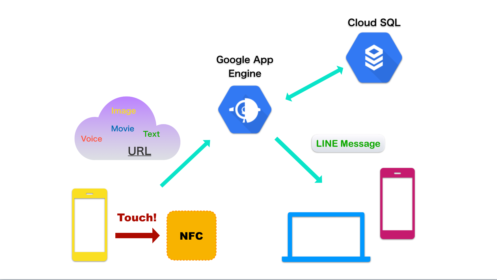

# IN TOUCH ~ Smarter communication ~

## 製品概要
### Communication Tech

### 背景（製品開発のきっかけ、課題等）
- 共働きのお父さんお母さんたちは子供がいつ帰宅したのか, 無事に帰宅できたのか把握できずに心配になることがしばしば. 子供は小さくてまだスマホの使い方もよくわかっていなかったり, わかっていても面倒で連絡を寄越さなかったり. また, テキストのみの連絡では, 送信主が本人である確証がないためちょっぴり不安だという家庭もあります.
そんな悩めるママ, パパの悩みを解決したいという気持ちがきっかけとなりました.

### 製品説明（具体的な製品の説明）

- スマートフォンをNFCタグにかざすだけで帰宅したことをLINEで親に通達してくれるサービスです. かざす操作のみで自動で録音・撮影を行い, それらのデータをLINE Botを経由して他の端末に送ります. スマートホンで”touch”するだけで「連絡が取ることができ」, 心に触れるような家族の心安らぐコミュニケーションを支援できるよう思いを込めて「In Touch」と名付けました。

### 特長

#### 1.
スマートフォンをNFCタグにかざすだけでマルチメディアメッセージを送信できるため, 近未来のようなスマートな連絡手段を実現しました. LINEのどの友達にはどのメディアでどんなメッセージを送信するかをユーザが自由に設定出来るため非常にカスタマイズ性が高く, 自由度の高いコミュニケーションを行えます. 比較的安価でSuicaやManacaなどの電子マネーカードでも代用できるNFCタグと, LINEという使いなれたツールを利用するので, ユーザがこのシステムを生活に導入するハードルやコストが低いことも長所です.

#### 2.
LINE Botを動作させるサーバはデータベースと連動しているため, 過去のメッセージを蓄積することで親は子供がいつどこにどんな状態で居たのかを確認したり, 帰宅時の「帰ったよ!」の代わりに, 「今日の給食はカレーで美味しかったよ!」といった感じで一日の感想を言えば, ちょっとした日記を音声のみで簡単に付けることなんかも可能です. LINE Botで「2019年10月20日」のように日付を送信したらその日のメッセージを返す機能も付け加えようとしましたが, 残念ながら間に合いませんでした.

### 解決出来ること
煩わしい手続きをスマートフォンをかざすという一つの動作に省略できるため, 日常生活をより快適なものにし, 結果的に安心感の溢れる家族生活に役立ちます.

### 今後の展望
応用範囲の広い技術だと思うので, 他にもこのワンタッチ動作で便利・快適になり得る場面を見つけてそれらの開発に取り組みたいです.

## 開発内容・開発技術
### 活用した技術
#### API・データ
* LineMessagingAPI
* GoogleCloudSQL
* GoogleAppEngine
* GoogleCloudStrage
* DropboxApi

#### フレームワーク・ライブラリ・モジュール
* Flask
* MySQL

#### デバイス
* NFCタグ

### 独自開発技術（Hack Dayで開発したもの）
#### 2日間に開発した独自の機能・技術
* アイディアから実装まですべて2日間で行いました
* URLに付随したデータからLINE Botが送信するデータの受け渡しの設定
* データベースを利用したメッセージの蓄積や日記機能
